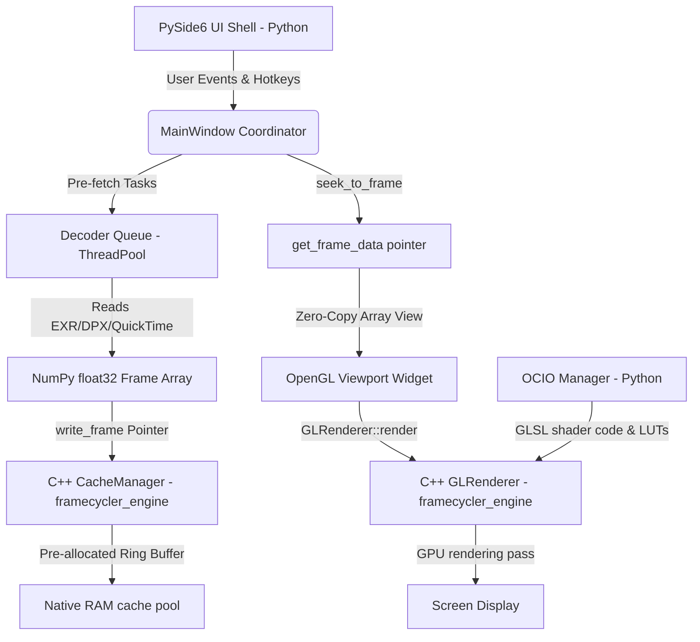

# Framecycler // VFX Review Application Technical Manual

Framecycler is a high-performance, lightweight Visual Effects Review application designed for Windows, macOS, and Linux. It is built on a **Hybrid Architecture** combining a compiled C++20 core engine (`framecycler_engine`) for memory allocations, cache eviction, and OpenGL rendering with a Python 3.12+ / PySide6 (Qt 6) UI shell for decoders and extension scriptability.

---

## 1. Architectural System Overview

Framecycler splits execution between native C++ and Python coordinates to bypass Python's Global Interpreter Lock (GIL), avoid garbage collection (GC) stutters during uncompressed 4K playback, and maintain custom Python extension tools.



### Key Subsystem Division
* **Python Layer**: Handles UI layouts, transport timer loops, metadata caching logic, background thread pre-fetching files loading (OpenCV / PyAV), and custom extension modules.
* **C++ Core Module (`framecycler_engine`)**: Written in C++20. Manages the contiguous raw frame memory cache blocks, LRU-based buffer recycling, and low-level GPU texture uploads / OpenGL shader rendering.

---

## 2. C++ Core Engine Subsystems

Located in `src/cpp/engine/` and compiled as a dynamic module (`.pyd` on Windows, `.so` on POSIX).

### A. Memory Management (`CacheManager`)
* **Contiguous Cache Allocation**: Instead of allocating new Python array memory structures for every frame (a single 4K 16-bit half-float frame is ~16MB; 32-bit float is ~33MB), the C++ core pre-allocates block vectors up to the configured RAM Cache Limit on startup.
* **Eviction Policy**: When memory usage approaches the limit, the C++ manager evicts the buffer slot representing the frame furthest from the playhead:
  $$\text{dist}(f, p) = \min(|f - p|, N - |f - p|)$$
  where $f$ is the slot's frame number, $p$ is the active playhead frame, and $N$ is the loop range length.
* **Zero-Allocation Write**: Decoders copy pixels directly into the reused memory addresses in the cache pool via `memcpy` operations.

### B. Viewport OpenGL Renderer (`GLRenderer`)
* **Platform extension loader (`gl_loader.h`)**: Dynamically resolves modern OpenGL core functions (like VAO, FBO, VBO, shaders, and 3D textures) on Windows utilizing the `wglGetProcAddress` queries at runtime, avoiding external loading library dependencies.
* **Color Processing (OCIO)**: Compiles native GLSL fragment shaders wrapping the color transforms and LUTs generated by PyOpenColorIO. LUT grids are uploaded directly to GPU 3D textures.
* **Comparisons & Masks**: Performs frame comparisons (Vertical split wipe drag, difference blending `abs(A - B)`, side-by-side tiling) and channel isolations (RGBA, R, G, B, A, Luminance) natively on the GPU during fragment shader execution.

---

## 3. PyBind11 Bindings Layer

The interface bindings are defined in `src/cpp/bindings/python_bindings.cpp`.

### Zero-Copy Memory Sharing
Framecycler achieves maximum performance by avoiding memory copying between C++ and Python. When Python requests cached frames, the C++ engine wraps the direct C++ pointer in a standard NumPy array structure:
```cpp
return py::array_t<float>(
    { height, width, channels },                                                  // Shape
    { width * channels * sizeof(float), channels * sizeof(float), sizeof(float) }, // Strides (row, col, chan)
    ptr,                                                                          // Raw pointer to C++ memory
    py::cast(&self)                                                               // Keeps C++ cache owner alive
);
```
This enables the PySide6 UI and OpenGL paint loop to reference the raw C++ buffer coordinates directly.

---

## 4. Extension Tooling Framework

Custom scripting tools are registered dynamically under the `Plugins` menu.

### Base Extension Class (`BaseTool`)
All custom tools inherit from [base_tool.py](file:///c:/Users/bernh/Github/Framecycler/src/framecycler/extensions/base_tool.py). It provides hooks to interface with application events:
* `on_init()`: Triggered when the tool is loaded at startup.
* `on_media_loaded(slot, file_path, metadata)`: Triggered when slots A/B load sequences.
* `on_frame_changed(frame_index, timecode)`: Fired on playhead updates.
* `get_menu_actions()`: Registers actions directly inside the main UI toolbar.

### Sample API Plugin (`OcioApiTool`)
The [ocio_api_tool.py](file:///c:/Users/bernh/Github/Framecycler/src/framecycler/extensions/ocio_api_tool.py) demonstrates how to connect to external JSON/REST endpoints to load show-specific OCIO configs dynamically.

---

## 5. Development & Compilation Instructions

### Virtual Environment Setup
1. Create and activate virtual environment:
   ```powershell
   python -m venv .venv
   .\.venv\Scripts\Activate.ps1
   ```
2. Install pip dependencies:
   ```bash
   pip install -r requirements.txt
   ```

### Compiling C++ Extensions (Windows)
Ensure you have **Visual Studio 2022 Build Tools (MSVC)** installed. Compile using the helper script:
```powershell
python build.py
```
* **NMake compilation mechanics**: The script locates `vcvars64.bat` to initialize compiler path variables, configures the generator (`-G "NMake Makefiles"`), and builds the target `.pyd` module.

### Running App & Tests
* Run Framecycler:
  ```bash
  python -m src.framecycler
  ```
* Run verification unit tests:
  ```bash
  python -m unittest discover -s tests
  ```

---

## 6. Keyboard Hotkeys Reference

| Key | Action |
| :--- | :--- |
| `Space` | Play / Pause |
| `Left` / `Right` | Step backward / forward by 1 frame |
| `Shift + Left/Right` | Step backward / forward by 10 frames |
| `[` | Set Playback Range **In** Point |
| `]` | Set Playback Range **Out** Point |
| `1` | View active **Slot A** |
| `2` | View active **Slot B** |
| `T` | Toggle timeline between **Frame Numbers** and **Timecode** |
| `Ctrl + H` | Toggle camera HUD viewfinder overlay |
| `F` | Reset Viewport Zoom & Pan |
