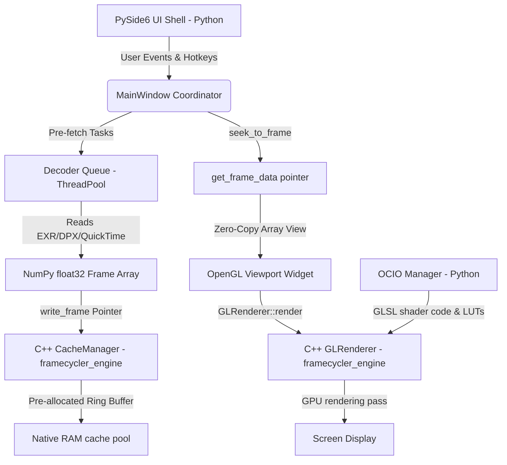

# Framecycler Reboot // VFX Review Application Technical Manual

Framecycler Reboot is a high-performance, lightweight Visual Effects Review application designed for Windows, macOS, and Linux. It is built on a **Hybrid Architecture** combining a compiled C++20 core engine (`framecycler_engine`) for memory allocations, cache eviction, and OpenGL rendering with a Python 3.12+ / PySide6 (Qt 6) UI shell for decoders and extension scriptability.

---

## 1. Architectural System Overview

Framecycler Reboot splits execution between native C++ and Python coordinates to bypass Python's Global Interpreter Lock (GIL), avoid garbage collection (GC) stutters during uncompressed 4K playback, and maintain custom Python extension tools.



### Key Subsystem Division
* **Python Layer**: Handles UI layouts, transport timer loops, metadata caching logic, background thread pre-fetching files loading (OpenImageIO for EXR/DPX, PyAV for QuickTime), and custom extension modules.
* **C++ Core Module (`framecycler_engine`)**: Written in C++20. Manages the contiguous raw frame memory cache blocks, LRU-based buffer recycling, and low-level GPU texture uploads / OpenGL shader rendering.

---

## 2. C++ Core Engine Subsystems

Located in `src/cpp/engine/` and compiled as a dynamic module (`.pyd` on Windows, `.so` on POSIX).

### A. Memory Management (`CacheManager`)
* **Contiguous Cache Allocation**: Instead of allocating new Python array memory structures for every frame (a single 4K 16-bit half-float frame is ~16MB; 32-bit float is ~33MB), the C++ core pre-allocates block vectors up to the configured RAM Cache Limit on startup.
* **Eviction Policy**: When memory usage approaches the limit, the C++ manager evicts the buffer slot representing the frame furthest from the playhead:
  $$\text{dist}(f, p) = \min(|f - p|, N - |f - p|)$$
  where $f$ is the slot's frame number, $p$ is the active playhead frame, and $N$ is the loop range length.
* **Zero-Allocation Write**: Decoders copy pixels directly into the reused memory addresses in the cache pool via `memcpy` operations.

### B. Viewport OpenGL Renderer (`GLRenderer`)
* **Platform extension loader (`gl_loader.h`)**: Dynamically resolves modern OpenGL core functions (like VAO, FBO, VBO, shaders, and 3D textures) on Windows utilizing the `wglGetProcAddress` queries at runtime, avoiding external loading library dependencies.
* **Coordinate Space Correction**: In OpenGL, texture coordinates begin at the bottom-left, whereas standard decoders index rows from the top-down. The vertex shader performs a vertical coordinate flip to map images right-side up:
  ```glsl
  uv = vec2(texCoords.x, 1.0 - texCoords.y);
  ```
* **Offscreen Panning & Clearing**: To allow panning the image outside the active viewport boundaries, the renderer clears the screen buffer color to black before each draw pass, avoiding trailing/ghosting artifacts:
  ```cpp
  glClearColor(0.0f, 0.0f, 0.0f, 1.0f);
  glClear(GL_COLOR_BUFFER_BIT | GL_DEPTH_BUFFER_BIT);
  ```
* **Color Processing (OCIO)**: Compiles native GLSL fragment shaders wrapping the color transforms and LUTs generated by PyOpenColorIO. LUT grids are uploaded directly to GPU 3D textures.
* **Comparisons & Masks**: Performs frame comparisons (Vertical split wipe drag, difference blending `abs(A - B)`, side-by-side tiling) and channel isolations (RGBA, R, G, B, A, Luminance) natively on the GPU during fragment shader execution.

---

## 3. PyBind11 Bindings Layer

The interface bindings are defined in `src/cpp/bindings/python_bindings.cpp`.

### Zero-Copy Memory Sharing
Framecycler Reboot achieves maximum performance by avoiding memory copying between C++ and Python. When Python requests cached frames, the C++ engine wraps the direct C++ pointer in a standard NumPy array structure:
```cpp
return py::array_t<float>(
    { height, width, channels },                                                  // Shape
    { width * channels * sizeof(float), channels * sizeof(float), sizeof(float) }, // Strides (row, col, chan)
    ptr,                                                                          // Raw pointer to C++ memory
    py::cast(&self)                                                               // Keeps C++ cache owner alive
    );
```
This enables the PySide6 UI and OpenGL paint loop to reference the raw C++ buffer coordinates directly.

---

## 4. Media Decoding & Sequence Resolving

Located in `src/framecycler/decoders/`.

Supported formats: **EXR** (`exr_decoder.py`, OpenImageIO), **DPX** (`dpx_decoder.py`, OpenImageIO), and **QuickTime/MPEG-4** (`qt_decoder.py`, PyAV/FFmpeg).

### A. Sequence Detection & Drop-in Handlers
When a single file is opened or dropped onto the application, `_find_sequence_from_single_file` inside `base.py` automatically parses its index pattern (e.g., `MOC_CAS_0010.0993.exr` $\rightarrow$ `MOC_CAS_0010.####.exr`), locates the directory, filters files matching that sequence name, and loads the sequence as a contiguous timeline starting at its absolute frame index.
* **Missing Frame Fallback**: If a frame is missing in a sequence (e.g. frame `0995` is deleted), the decoder identifies the closest available frame index and loads that instead, preventing decoding crashes.

### B. Timecode-to-Frame Translations
* **Image Sequences**: Enforces actual frame numbering extracted from file names, initializing the global playback ranges to these absolute limits.
* **QuickTime Movies**: Parses the file's start timecode metadata and translates it to absolute timeline frame numbers (e.g. `08:00:00:00` $\rightarrow$ absolute start frame `691200` at 24fps) so sequences and movie clips align correctly on the master timeline.

---

## 5. OCIO Color Pipeline

Located in `src/framecycler/color/` (`ocio_manager.py`) with the default studio configuration in `src/framecycler/color/studio_config/config.ocio`.

### A. Configuration Loading Priority

On startup (and when **File → Settings…** is accepted), `OCIOManager` resolves the active OCIO config in this order:

| Priority | Source | Notes |
| :--- | :--- | :--- |
| **1** | `OCIO` environment variable | Standard OpenColorIO env var. Must point to an existing `.ocio` file. |
| **2** | Settings file path | Optional path saved in **File → Settings… → Custom OCIO Configuration File**. |
| **3** | Bundled studio config | Shipped default at `color/studio_config/config.ocio`. |

If a higher-priority source is set but fails to load (missing file, parse error), the manager falls through to the next source. If all sources fail, the app runs in passthrough mode (`Raw` only).

**Examples:**

```bash
# macOS / Linux — studio config from the shell (highest priority)
export OCIO=/show/configs/project.ocio
python -m src.framecycler
```

```powershell
# Windows PowerShell
$env:OCIO = "D:\show\configs\project.ocio"
python -m src.framecycler
```

To persist a config path without setting the env var each session, enter it in **File → Settings…** and click **OK**. The path is saved to `~/.framecycler/settings.json` under `ocio_config_path`.

### B. Bundled Studio Configuration

The default config uses **OCIO profile version 2.2** and defines:

* **Reference / working space**: `ACEScg` (via the `rendering` and `scene_linear` roles)
* **Display views**: `sRGB View`, `Rec.709 View`, `ACEScg Linear`, and `Raw`
* **Looks**: e.g. `ARRI LogC3 to Rec709`, `ARRI LogC4 to Rec709`
* **LUT search path**: `luts/` relative to the config file

Supported camera log color spaces mapped to the linear reference space include:

* **ARRI Alexa LogC3**
* **ARRI LogC4**
* **Cineon (ADX10)**
* **Sony S-Log3**
* **Panasonic V-Log**
* **RED Log3G10**

### C. Runtime Pipeline Controls

The **OCIO** menu exposes the active config at runtime:

* **Input Color Space** — source interpretation for loaded media (default `ACEScg` when present in the config)
* **Look** — optional creative transform, or **None (Bypass)**
* **Display Output** — `Raw`, `sRGB`, or `Rec709`
* **Load Custom LUT…** — inject a `.cube` file as a file transform in the GPU pipeline

The viewport header shows the current pipeline state, e.g. `IN: ARRI Alexa LogC3 | OUT: sRGB (sRGB View)`.

### D. Automatic Input Color Space Detection

When media is loaded into Slot A, the app attempts to set the input color space automatically from:

1. **Metadata** — EXR/QuickTime color tags, DPX transfer characteristic, etc.
2. **Filename hints** — e.g. `plate_logc3.####.exr`, `comp_acescg.exr`
3. **File extension fallbacks** — e.g. `.exr` → `ACEScg`, `.dpx` → `Cineon (ADX10)`, `.mov` → `Rec.709 - Texture`

Detected spaces are validated against the active OCIO config; unknown values fall back to `Raw` or the config’s default role.

### E. GPU Shader Compilation

Color transforms are compiled to GLSL by PyOpenColorIO and injected into the C++ `GLRenderer` fragment shader (`ocio_color_transform`). The pipeline includes:

* Input color space → working space conversion
* Interactive grading (CDL exposure / gamma / offset from the **Tools → Grading** menu)
* Optional look or custom LUT
* Display output encoding (`sRGB`, Rec.709 gamma, or passthrough `Raw`)

**API compatibility**: Uses a dual-path LUT upload. If the modern PyOpenColorIO iterator API is present (`get3DTextures` / `getTextures`), it reads `Texture3D` objects via `edgeLen` and `getValues()`. Legacy builds fall back to index-based queries (`getNum3DTextures`).

LUT grids are uploaded to GPU 3D textures and sampled in the fragment shader during each viewport draw.

---

## 6. User Interface & Layout Structure

Located in `src/framecycler/ui/`.

* **Unified Header**: Displays `LAYER` and `COMPARE` dropdowns alongside the `Resolution` readout (e.g., `2048x1080`) and active `OCIO config status` (e.g. `IN: ARRI Alexa LogC3 | OUT: sRGB (sRGB View)`).
* **Viewfinder Overlay (HUD)**: Removed cluttered status text from the viewport area, keeping only the A/B compare slider wipe line inside the image container.
* **Timeline Status Row**: Positioned directly above the timeline slider. Displays `FR`, `FPS`, and `TC` in a clean, larger `Segoe UI` font that matches the timeline theme.
* **Centered Transport Controls**: The playback buttons and loop mode dropdown are centered in the bottom transport bar, with `TC / FR` toggle aligned on the far right.
* **Grading Menu**: Adds a **Grading** menu with interactive exposure, gamma, and offset adjustment modes (mouse-drag in the viewport). **Reset Color Grade** restores defaults (`Exposure: 0.0`, `Gamma: 1.0`, `Offset: 0.0`) via the menu or the `Home` shortcut.
* **Plugins Menu**: Hosts registered extension tools (e.g. **Load OCIO from External API...** from `extensions/ocio_api_tool.py`).
* **Channel Mask Highlights**: The quick channel selection buttons on the top right (`RGB`, `R`, `G`, `B`, `A`, `LUM`) are checkable and automatically highlight in blue (`#007acc`) when selected.

---

## 7. Development & Compilation Instructions

### Automated Script Launches
* **Windows**: Double-click or run [run.bat](run.bat) from PowerShell/CMD. It automatically activates `.venv`, verifies and installs dependencies in `requirements.txt`, builds the C++ module if missing, and launches the app passing any CLI parameters.
* **macOS / Linux**: Use [run.sh](run.sh), which performs identical checks and compiles/executes on POSIX systems.

### Manual Virtual Environment Setup
1. Create and activate virtual environment:
   ```powershell
   # Windows
   python -m venv .venv
   .\.venv\Scripts\Activate.ps1
   ```
   ```bash
   # macOS / Linux
   python3 -m venv .venv
   source .venv/bin/activate
   ```
2. Install pip dependencies:
   ```bash
   pip install -r requirements.txt
   ```

### Compiling C++ Extensions
Ensure **CMake** is available (installed via pip in `requirements.txt`, or system package manager). On Windows, also install **Visual Studio 2022 Build Tools (MSVC)**. Compile using the helper script:
```bash
python build.py
```
* **Windows**: The script locates `vcvars64.bat` to initialize compiler path variables, configures the generator (`-G "NMake Makefiles"`), and builds the target `.pyd` module.
* **macOS / Linux**: Uses standard CMake configure/build. On macOS, the compiled `.so` is ad-hoc signed automatically to satisfy Gatekeeper on import.

### Running App & Tests
* Run Framecycler Reboot manually:
   ```bash
   python -m src.framecycler
   ```
* Run verification unit tests:
   ```bash
   python -m unittest discover -s tests
   ```

### Packaging & In-App Updates
* **Release builds** are produced by the GitHub Actions workflow [`.github/workflows/package.yml`](.github/workflows/package.yml) when a version tag such as `v1.0.0` is pushed. Each platform job builds with PyInstaller, packages via [Velopack](https://velopack.io), and publishes merged assets to GitHub Releases.
* **First install**: download the Velopack installer/portable bundle for your OS from the GitHub Release page (Windows Setup/portable zip, macOS installer, Linux AppImage).
* **Manual update check**: in a packaged build, use **Help → Check for Updates…** to fetch and apply the latest release from GitHub. Updates are not available when running from source (`python -m src.framecycler`).
* **Unsigned builds (current)**: releases are not code-signed or notarized yet. macOS Gatekeeper and Windows SmartScreen may warn on first launch and again after an update; use the same right-click → Open workaround as with the current zip/installer builds.
* **Retrying a failed release**: if a tagged release workflow partially uploaded assets and then failed, delete the GitHub Release for that tag before re-running the full workflow. Velopack `--merge` can add new assets to a release but cannot replace existing ones (e.g. `releases.win.json`). Re-running only failed jobs is fine when earlier platforms already uploaded successfully.

---

## 8. Keyboard Hotkeys Reference

| Key | Action |
| :--- | :--- |
| `Space` | Play / Pause |
| `Left` / `Right` | Step backward / forward by 1 frame |
| `Shift + Left/Right` | Step backward / forward by 10 frames |
| `Shift + X` | Clear viewer inputs (empty slots A & B) |
| `[` | Set Playback Range **In** Point |
| `]` | Set Playback Range **Out** Point |
| `1` | View active **Slot A** |
| `2` | View active **Slot B** |
| `Ctrl + H` | Toggle camera HUD viewfinder overlay |
| `F` | Reset Viewport Zoom & Pan |
| `E` | Enter interactive **Exposure** adjustment mode |
| `Y` | Enter interactive **Gamma** adjustment mode |
| `O` | Enter interactive **Offset** adjustment mode |
| `Home` | Reset color grading to defaults |
| `R` | Toggle **Red** channel isolation |
| `G` | Toggle **Green** channel isolation |
| `B` | Toggle **Blue** channel isolation |
| `A` | Toggle **Alpha** channel isolation |

The **TC / FR** readout toggle is available from the transport bar button; it is not bound to a keyboard shortcut.
