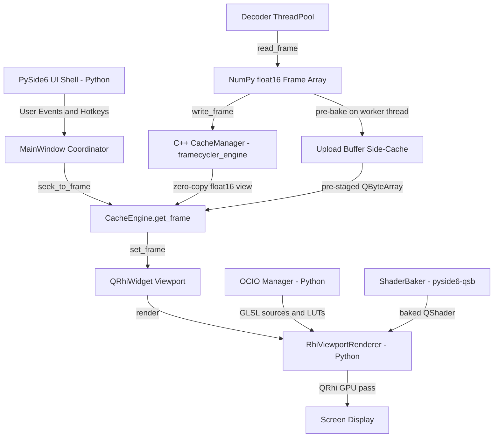

# Framecycler Reboot // VFX Review Application Technical Manual

Framecycler Reboot is a high-performance, lightweight Visual Effects Review application designed for Windows, macOS, and Linux. It is built on a **Hybrid Architecture** combining a compiled C++20 core engine (`framecycler_engine`) for frame RAM caching with a Python 3.12+ / PySide6 (Qt 6.11) UI shell for decoding, Qt RHI GPU rendering, and extension scriptability.

---

## 1. Architectural System Overview

Framecycler Reboot splits execution between native C++ and Python coordinates to bypass Python's Global Interpreter Lock (GIL), avoid garbage collection (GC) stutters during uncompressed 4K playback, and maintain custom Python extension tools.



### Key Subsystem Division
* **Python Layer**: Handles UI layouts, transport timer loops, background decode prefetch (`CacheEngine`), OCIO shader bundling, **Qt RHI viewport rendering** (`RhiViewportRenderer`), and custom extension modules. Decoders load EXR/DPX via OpenImageIO and QuickTime via PyAV.
* **C++ Core Module (`framecycler_engine`)**: Written in C++20. Manages contiguous half-float frame cache blocks, playhead-aware eviction, and zero-copy NumPy views into cached pixel memory. GPU rendering was moved to Python to avoid dual-Qt linking instability on macOS.

Legacy OpenGL rendering (`GLRenderer`, `gl_loader.h`) and the C++ `RhiRenderer` were removed in the Qt RHI migration. The viewport now renders entirely through PySide6 `QRhiWidget` and `RhiViewportRenderer`.

---

## 2. Core Engine Subsystems

### A. C++ Frame Cache (`CacheManager`)

Located in `src/cpp/engine/` and compiled as a dynamic module (`.pyd` on Windows, `.so` on POSIX). Exposed to Python via PyBind11 in `src/cpp/bindings/python_bindings.cpp`.

* **Contiguous Cache Allocation**: Instead of allocating new Python array structures for every frame (a single 4K RGBA half-float frame is ~33MB), the C++ core pre-allocates block vectors up to the configured RAM Cache Limit.
* **Eviction Policy**: When memory usage approaches the limit, the C++ manager evicts the buffer slot representing the frame furthest from the playhead:
  $$\text{dist}(f, p) = \min(|f - p|, N - |f - p|)$$
  where $f$ is the slot's frame number, $p$ is the active playhead frame, and $N$ is the loop range length.
* **Half-Float Storage**: Cached frames are stored as `float16` (`RGBA16F` or `R16F` channel layouts). Decoders copy pixels into reused cache slots via `std::copy`.
* **Concurrent Access**: `has_frame`, `get_frame_data`, and `get_cached_frames` use shared locks; `write_frame` and eviction use exclusive locks (`std::shared_mutex`) so playback reads are not blocked for the full duration of large frame writes.

### B. Python Cache Orchestration (`CacheEngine`)

Located in `src/framecycler/core/cache.py`. Wraps `CacheManager` with decode prefetch and upload staging.

* **Background Prefetch**: A manager thread schedules up to 100 frames ahead of the playhead on a `ThreadPoolExecutor` (size configurable via **Settings → Reader Threads**).
* **Non-Blocking Playback**: `get_frame()` returns a zero-copy NumPy view on cache hit. On miss, it schedules a high-priority decode and returns `None` without blocking the GUI thread (the viewport holds the previous frame until the decode completes).
* **Pre-Staged GPU Upload Buffers**: After each frame is decoded and written to the C++ cache, the decode worker pre-packs the pixel data into a `QByteArray` upload buffer on a **background thread**. This moves the expensive `tobytes()` + `QByteArray` copy (~25ms at 4608×3164) off the GUI thread during steady playback.
* **Bounded Upload Side-Cache**: Pre-staged buffers are kept in a separate Python-side cache sized to ~3 seconds of frames (independent of the RAM cache limit) and evicted by playhead distance, avoiding unbounded memory growth.
* **Timeline Cache Indicator**: During playback, the timeline's cached-frame overlay refreshes on a 250ms timer instead of every `seek_to_frame` tick, reducing mutex contention from `get_cached_frames()` on the GUI thread.

### C. Python Qt RHI Viewport Renderer (`RhiViewportRenderer`)

Located in `src/framecycler/render/rhi_viewport_renderer.py`. Called from `Viewport` (`QRhiWidget` subclass in `src/framecycler/ui/viewport.py`).

* **Why Python, not C++**: Rendering uses the same PySide6 `QRhi*` instance as the widget, avoiding dual-Qt SDK linking crashes that occurred when a C++ module compiled against one Qt build was loaded alongside PySide6 at runtime (especially on macOS).
* **Backend selection**: `QRhiWidget` selects Metal (macOS), D3D11/12 (Windows), Vulkan, or OpenGL ES per platform. The active backend is logged once at viewport initialization (e.g. `Viewport: QRhi backend = Metal`).
* **Shader baking**: OCIO vertex/fragment GLSL is baked via `pyside6-qsb` (`ShaderBaker` in `shader_baker.py`) into backend-specific `QShader` blobs at pipeline change time (look, colorspace, display output, or custom LUT change — not per frame).
* **Texture uploads**: Frame buffers are uploaded as `RGBA16F` or `R16F` QRhi textures. During playback, pre-staged `QByteArray` buffers from `CacheEngine` are passed directly to `uploadTexture`. Upload-token deduplication skips redundant GPU transfers when the playhead holds on a frame.
* **Fallback logging**: If a frame is displayed before its upload buffer is ready (e.g. scrub to an uncached frame), the renderer falls back to synchronous main-thread packing and emits a rate-limited warning. Shader bake failures, missing pipelines, decode errors, and EXR nearest-frame fallbacks are also logged explicitly.
* **Color Processing (OCIO)**: OCIO-generated GLSL is injected into the fragment template (`ocio_color_transform`). 3D LUT grids are uploaded slice-by-slice to QRhi 3D textures (required on Metal/Vulkan). Interactive grading (exposure / gamma / offset) updates a dynamic uniform buffer without rebaking shaders.
* **Comparisons & Masks**: Performs frame comparisons (vertical wipe, difference blending `abs(A - B)`, side-by-side tiling) and channel isolations (RGBA, R, G, B, A, Luminance) in the fragment shader.

---

## 3. PyBind11 Bindings Layer

The interface bindings are defined in `src/cpp/bindings/python_bindings.cpp`. The compiled module exposes **only** `CacheManager` — GPU rendering is handled entirely in Python.

### Zero-Copy Memory Sharing
Framecycler Reboot avoids copying cached frame pixels between C++ and Python. When Python requests a cached frame, the C++ engine wraps the direct pointer in a NumPy `float16` view:
```cpp
return py::array(
    py::dtype("float16"),
    { height, width, channels },
    {
        static_cast<py::ssize_t>(width * channels * sizeof(uint16_t)),
        static_cast<py::ssize_t>(channels * sizeof(uint16_t)),
        static_cast<py::ssize_t>(sizeof(uint16_t))
    },
    const_cast<uint16_t*>(ptr),
    self   // keeps CacheManager alive
);
```
The viewport references this zero-copy view for dimensions and metadata. GPU upload uses a separately pre-staged `QByteArray` built on decode worker threads (see §2.B).

---

## 4. Media Decoding & Sequence Resolving

Located in `src/framecycler/decoders/`.

Supported formats: **EXR** (`exr_decoder.py`, OpenImageIO), **DPX** (`dpx_decoder.py`, OpenImageIO), and **QuickTime/MPEG-4** (`qt_decoder.py`, PyAV/FFmpeg).

### A. Sequence Detection & Drop-in Handlers
When a single file is opened or dropped onto the application, `_find_sequence_from_single_file` inside `base.py` automatically parses its index pattern (e.g., `MOC_CAS_0010.0993.exr` $\rightarrow$ `MOC_CAS_0010.####.exr`), locates the directory, filters files matching that sequence name, and loads the sequence as a contiguous timeline starting at its absolute frame index.
* **Missing Frame Fallback**: If a frame is missing in a sequence (e.g. frame `0995` is deleted), the decoder identifies the closest available frame index and loads that instead, preventing decoding crashes. A warning is logged naming the requested and served frame indices.

### B. Timecode-to-Frame Translations
* **Image Sequences**: Enforces actual frame numbering extracted from file names, initializing the global playback ranges to these absolute limits.
* **QuickTime Movies**: Parses the file's start timecode metadata and translates it to absolute timeline frame numbers (e.g. `08:00:00:00` $\rightarrow$ absolute start frame `691200` at 24fps) so sequences and movie clips align correctly on the master timeline.

---

## 5. OCIO Color Pipeline

Located in `src/framecycler/color/` (`ocio_manager.py`) with the default studio configuration in `src/framecycler/color/studio_config/config.ocio`.

### A. Configuration Loading Priority

On startup (and when **File → Settings…** is accepted), `OCIOManager` resolves the active OCIO config in this order:

| Priority | Source | Notes |
| :--- | :--- | :--- |
| **1** | `OCIO` environment variable | Standard OpenColorIO env var. Must point to an existing `.ocio` file. |
| **2** | Settings file path | Optional path saved in **File → Settings… → Custom OCIO Configuration File**. |
| **3** | Bundled studio config | Shipped default at `color/studio_config/config.ocio`. |

If a higher-priority source is set but fails to load (missing file, parse error), the manager falls through to the next source. If all sources fail, the app runs in passthrough mode (`Raw` only).

**Examples:**

```bash
# macOS / Linux — studio config from the shell (highest priority)
export OCIO=/show/configs/project.ocio
python -m src.framecycler
```

```powershell
# Windows PowerShell
$env:OCIO = "D:\show\configs\project.ocio"
python -m src.framecycler
```

To persist a config path without setting the env var each session, enter it in **File → Settings…** and click **OK**. The path is saved to `~/.framecycler/settings.json` under `ocio_config_path`.

### B. Bundled Studio Configuration

The default config uses **OCIO profile version 2.2** and defines:

* **Reference / working space**: `ACEScg` (via the `rendering` and `scene_linear` roles)
* **Display views**: `sRGB View`, `Rec.709 View`, `ACEScg Linear`, and `Raw`
* **Looks**: e.g. `ARRI LogC3 to Rec709`, `ARRI LogC4 to Rec709`
* **LUT search path**: `luts/` relative to the config file

Supported camera log color spaces mapped to the linear reference space include:

* **ARRI Alexa LogC3**
* **ARRI LogC4**
* **Cineon (ADX10)**
* **Sony S-Log3**
* **Panasonic V-Log**
* **RED Log3G10**

### C. Runtime Pipeline Controls

The **OCIO** menu exposes the active config at runtime:

* **Input Color Space** — source interpretation for loaded media (default `ACEScg` when present in the config)
* **Look** — optional creative transform, or **None (Bypass)**
* **Display Output** — `Raw`, `sRGB`, or `Rec709`
* **Load Custom LUT…** — inject a `.cube` file as a file transform in the GPU pipeline

The viewport header shows the current pipeline state, e.g. `IN: ARRI Alexa LogC3 | OUT: sRGB (sRGB View)`.

### D. Automatic Input Color Space Detection

When the first media source is loaded, the app attempts to set the input color space automatically from:

1. **Metadata** — EXR/QuickTime color tags, DPX transfer characteristic, etc.
2. **Filename hints** — e.g. `plate_logc3.####.exr`, `comp_acescg.exr`
3. **File extension fallbacks** — e.g. `.exr` → `ACEScg`, `.dpx` → `Cineon (ADX10)`, `.mov` → `Rec.709 - Texture`

Detected spaces are validated against the active OCIO config; unknown values fall back to `Raw` or the config’s default role.

### E. GPU Shader Compilation

Color transforms are compiled to GLSL 450 by PyOpenColorIO and injected into the Python `RhiViewportRenderer` fragment shader template (`ocio_color_transform`). Shader sources are baked with `pyside6-qsb` at pipeline change time; the pipeline includes:

* Input color space → working space conversion
* Interactive grading (CDL exposure / gamma / offset from the **Tools → Grading** menu) via dynamic OCIO uniform buffer updates — no shader rebake while dragging
* Optional look or custom LUT
* Display output encoding (`sRGB`, Rec.709 gamma, or passthrough `Raw`)

**API compatibility**: Uses a dual-path LUT upload. If the modern PyOpenColorIO iterator API is present (`get3DTextures` / `getTextures`), it reads `Texture3D` objects via `edgeLen` and `getValues()`. Legacy builds fall back to index-based queries (`getNum3DTextures`).

LUT grids are uploaded to QRhi 3D textures (slice-by-slice on Metal/Vulkan) and sampled in the fragment shader during each viewport draw.

Shader templates live in `src/framecycler/render/shaders/`; Python-side bundling is in `src/framecycler/render/shader_pipeline.py`; baking is in `src/framecycler/render/shader_baker.py`.

---

## 6. User Interface & Layout Structure

Located in `src/framecycler/ui/`.

* **Compare Modes** (Tools → Compare): **Sequence** (default, plays sources back-to-back on a concatenated timeline), **Wipe** and **Difference** (first two sources), **Tile** (all sources in an aspect-preserving grid).
* **File → Add Media**: Append a new source to the list. Drag-and-drop shows a **Replace Media** / **Add Media** overlay (left replaces all, right appends).
* **Viewfinder Overlay (HUD)**: Keeps the Wipe compare divider line inside the image container when Wipe mode is active.
* **Timeline Status Row**: Positioned directly above the timeline slider. Displays `FR`, `FPS`, and `TC` in a clean, larger `Segoe UI` font that matches the timeline theme.
* **Centered Transport Controls**: The playback buttons and loop mode dropdown are centered in the bottom transport bar, with `TC / FR` toggle aligned on the far right.
* **Grading Menu**: Adds a **Grading** menu with interactive exposure, gamma, and offset adjustment modes (mouse-drag in the viewport). **Reset Color Grade** restores defaults (`Exposure: 0.0`, `Gamma: 1.0`, `Offset: 0.0`) via the menu or the `Home` shortcut.
* **Plugins Menu**: Hosts registered extension tools (e.g. **Load OCIO from External API...** from `extensions/ocio_api_tool.py`).
* **Channel Mask Highlights**: The quick channel selection buttons on the top right (`RGB`, `R`, `G`, `B`, `A`, `LUM`) are checkable and automatically highlight in blue (`#007acc`) when selected.

---

## 7. Development & Compilation Instructions

### Automated Script Launches
* **Windows**: Double-click or run [run.bat](run.bat) from PowerShell/CMD. It automatically activates `.venv`, verifies and installs dependencies in `requirements.txt`, builds the C++ module if missing, and launches the app passing any CLI parameters.
* **macOS / Linux**: Use [run.sh](run.sh), which performs identical checks and compiles/executes on POSIX systems.

### Manual Virtual Environment Setup
1. Create and activate virtual environment:
   ```powershell
   # Windows
   python -m venv .venv
   .\.venv\Scripts\Activate.ps1
   ```
   ```bash
   # macOS / Linux
   python3 -m venv .venv
   source .venv/bin/activate
   ```
2. Install pip dependencies:
   ```bash
   pip install -r requirements.txt
   ```

### Compiling C++ Extensions
Ensure **CMake** is available (installed via pip in `requirements.txt`, or system package manager). On Windows, also install **Visual Studio 2022 Build Tools (MSVC)**.

The C++ engine depends only on **pybind11** (no Qt SDK required for compilation). GPU rendering and shader baking run in Python via PySide6:

```bash
python build.py
```

* **Windows**: The script locates `vcvars64.bat`, configures NMake, and builds the `.pyd` module.
* **macOS / Linux**: Standard CMake configure/build. On macOS, the compiled `.so` is ad-hoc signed automatically to satisfy Gatekeeper on import.

Shader baking at runtime uses `pyside6-qsb` (bundled with PySide6). Pinned dependency: `PySide6==6.11.1` (QRhiWidget + ShaderTools).

### Running App & Tests
* Run Framecycler Reboot manually:
   ```bash
   python -m src.framecycler
   ```
* Run verification unit tests:
   ```bash
   python -m unittest discover -s tests
   ```

### Packaging & In-App Updates
* **Release builds** are produced by the GitHub Actions workflow [`.github/workflows/package.yml`](.github/workflows/package.yml) when a version tag such as `v1.0.0` is pushed. Each platform job builds with PyInstaller, packages via [Velopack](https://velopack.io), and publishes merged assets to GitHub Releases.
* **First install**: download the Velopack installer/portable bundle for your OS from the GitHub Release page (Windows Setup/portable zip, macOS installer, Linux AppImage).
* **Manual update check**: in a packaged build, use **Help → Check for Updates…** to fetch and apply the latest release from GitHub. Updates are not available when running from source (`python -m src.framecycler`).
* **Unsigned builds (current)**: releases are not code-signed or notarized yet. macOS Gatekeeper and Windows SmartScreen may warn on first launch and again after an update; use the same right-click → Open workaround as with the current zip/installer builds.
* **Retrying a failed release**: if a tagged release workflow partially uploaded assets and then failed, delete the GitHub Release for that tag before re-running the full workflow. Velopack `--merge` can add new assets to a release but cannot replace existing ones (e.g. `releases.win.json`). Re-running only failed jobs is fine when earlier platforms already uploaded successfully.

---

## 8. Keyboard Hotkeys Reference

On macOS, shortcuts written as **Ctrl** use the **Command (⌘)** key (Qt cross-platform convention).

### Playback & timeline

| Key | Action |
| :--- | :--- |
| `Space` | Play / pause |
| `Left` / `Right` | Step backward / forward by 1 frame |
| `Shift + Left` / `Shift + Right` | Step backward / forward by 10 frames |
| `Ctrl + Left` / `Ctrl + Right` | Jump to previous / next clip; sets in/out to that clip and seeks to its first frame |
| `[` | Set playback range **in** point |
| `]` | Set playback range **out** point |
| `T` | Toggle frame number / timecode readout |

### File

| Key | Action |
| :--- | :--- |
| `Shift + X` | Clear all loaded media sources |

### View

| Key | Action |
| :--- | :--- |
| `Ctrl + H` | Toggle HUD overlay |
| `F` | Fit viewport to screen |
| `1` | Zoom to actual size (100%) |
| `2` | Zoom to 200% |
| `3` | Zoom to 300% |
| `4` | Zoom to 400% |

### Grading (Tools menu)

| Key | Action |
| :--- | :--- |
| `E` | Enter interactive **exposure** adjustment mode (drag horizontally in viewport) |
| `Y` | Enter interactive **gamma** adjustment mode |
| `O` | Enter interactive **offset** adjustment mode |
| `Home` | Reset color grading to defaults |

### Channel isolation

| Key | Action |
| :--- | :--- |
| `R` | Toggle **red** channel isolation (press again for RGB) |
| `G` | Toggle **green** channel isolation |
| `B` | Toggle **blue** channel isolation |
| `A` | Toggle **alpha** channel isolation |

### Viewport mouse (no key binding)

| Action | Behavior |
| :--- | :--- |
| Click | Toggle play / pause |
| Horizontal drag | Scrub frames (stops playback; playhead stays on release frame) |

Compare modes (**Sequence**, **Wipe**, **Difference**, **Tile**) and panel visibility (**View → Panels → Media Sources**) are menu-only. Pixel aspect ratio and resolution scale are per-source and adjusted from the **Image** menu.
