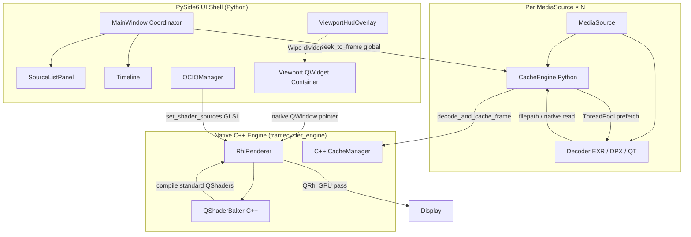

# Framecycler Reboot // VFX Review Application Technical Manual

Framecycler Reboot is a high-performance, lightweight Visual Effects Review application designed for Windows, macOS, and Linux. It is built on a **Hybrid Architecture** combining a compiled C++20 core engine (`framecycler_engine`) for per-source frame RAM caching and native Qt RHI GPU rendering with a Python 3.12+ / PySide6 (Qt 6.10+) UI shell for multi-source timeline coordination, UI layouts, and extension scriptability.

---

## 1. Architectural System Overview

Framecycler Reboot splits execution between native C++ and Python coordinates to bypass Python's Global Interpreter Lock (GIL), avoid garbage collection (GC) stutters during uncompressed 4K playback, and maintain custom Python extension tools. The application loads an **ordered list of media sources** (`MediaSource`), each with its own decoder and C++ RAM cache, onto a **single concatenated global timeline** for Sequence playback and multi-source compare modes.



### Key Subsystem Division
* **Python Layer**: Handles UI layouts, transport timer loops, **multi-source timeline coordination** (`media_source.py`), per-source background decode prefetch scheduling (`CacheEngine` per `MediaSource`), and custom extension modules. Decoders resolve sequence file structures, reading EXR/DPX via OpenImageIO and QuickTime via PyAV.
* **C++ Core Module (`framecycler_engine`)**: Written in C++20. Manages contiguous half-float frame cache blocks and playhead-aware eviction (`CacheManager`), and handles **native GPU presentation and rendering** (`RhiRenderer`) on a dedicated render thread. GPU rendering interacts directly with PySide6's Qt RHI context to avoid dual-Qt linking crashes.

The viewport renders entirely through the C++ `RhiRenderer` targeting a native `QWindow` container, providing low-overhead, zero-copy texture uploads and parallel execution. The older fixed **Slot A / Slot B** dual-decoder model was replaced in v0.2.4 by the ordered `sources` list and concatenated timeline.

---

## 2. Core Engine Subsystems

### A. Multi-Source Media Model (`MediaSource`)

Located in `src/framecycler/core/media_source.py`. Each loaded clip or sequence is wrapped as a `MediaSource` dataclass with its own `BaseDecoder`, `CacheEngine`, dimensions, FPS, and per-source display settings (`pixel_aspect_ratio`, `resolution_scale`).

* **Ordered source list**: `MainWindow.sources` holds sources in playback/compare order. **File → Add Media** appends; drag-and-drop **Replace** (left zone) clears and reloads, **Add** (right zone) appends.
* **Concatenated global timeline**: `rebuild_timeline_offsets()` assigns each source a `timeline_offset`. Global frames run `0 … total_frame_count−1` across all clips back-to-back. `global_to_local()` maps the playhead to `(source_index, local_frame)` for Sequence mode.
* **Decoder frame mapping**: Decoders use absolute frame numbers (sparse sequence indices, QuickTime timecode offsets). `decoder_frame_for_source()` and `local_index_to_decoder_frame()` translate between global timeline position and per-decoder frame requests.
* **Seek orchestration**: `seek_to_frame()` updates every source's cache playhead, requests frames at the mapped decoder frame for each source, and pushes results into the renderer via `update_render_params()`.
* **Two source indices**:
  * **`sequence_index`** — derived from the global playhead; drives Sequence mode display, transport readout FPS/resolution sync, and sidebar highlight during playback.
  * **`active_source_index`** — user selection in the **Media Sources** panel; drives EXR layer UI, cache-overlay scope, and per-source Image menu targets (resolution scale, pixel aspect).
* **Compare frame sync**: In Wipe, Difference, and Tile modes, all sources are sampled at the same global playhead. Frames outside a source's segment clamp to that clip's first or last frame so comparisons stay time-aligned.

### B. C++ Frame Cache (`CacheManager`)

Located in `src/cpp/engine/` and compiled as a dynamic module (`.pyd` on Windows, `.so` on POSIX). Exposed to Python via PyBind11 in `src/cpp/bindings/python_bindings.cpp`.

* **Contiguous Cache Allocation**: Instead of allocating new Python array structures for every frame (a single 4K RGBA half-float frame is ~33MB), the C++ core pre-allocates block vectors up to the configured RAM Cache Limit.
* **Eviction Policy**: When memory usage approaches the limit, the C++ manager evicts the buffer slot representing the frame furthest from the playhead:
  $$\text{dist}(f, p) = \min(|f - p|, N - |f - p|)$$
  where $f$ is the slot's frame number, $p$ is the active playhead frame, and $N$ is the loop range length.
* **Half-Float Storage**: Cached frames are stored as `float16` (`RGBA16F` or `R16F` channel layouts). C++ native decoders compile pixel data directly into reused cache slots via OpenImageIO.
* **Concurrent Access**: `has_frame`, `get_frame_data`, and `get_cached_frames` use shared locks; `write_frame` and eviction use exclusive locks (`std::shared_mutex`) so playback reads are not blocked for the full duration of large frame writes.

### C. Python Cache Orchestration (`CacheEngine`)

Located in `src/framecycler/core/cache.py`. One `CacheEngine` wraps one `CacheManager` per `MediaSource`, managing background prefetch scheduling.

* **Background Prefetch**: A manager thread schedules up to 100 frames ahead of the playhead on a `ThreadPoolExecutor` (size configurable via **Settings → Reader Threads**).
* **Parallel Decodes**: If the decoder provides file paths, `CacheEngine` delegates decoding to C++ via `decode_and_cache_frame()`, bypassing the Python GIL. For fallback python-based decoders, `write_frame()` writes pixel arrays directly into the pre-allocated C++ slots.
* **Non-Blocking Playback**: If a frame is a cache hit, C++ returns a NumPy view. On cache miss, a high-priority background decode is scheduled, and the UI continues playing without stuttering.
* **Timeline Cache Indicator**: During playback, the timeline's cached-frame overlay refreshes on a 250ms timer instead of every `seek_to_frame` tick, reducing mutex contention from `get_cached_frames()` on the GUI thread.

### D. C++ Qt RHI Viewport Renderer (`RhiRenderer`)

Located in `src/cpp/engine/rhi_renderer.cpp`. The viewport UI containerizes a native `QWindow` and binds it to a native `RhiRenderer` instance.

* **Direct C++ Rendering**: Viewport draws are executed directly inside C++ on a dedicated render thread. It links against the PySide6 Qt libraries dynamically, avoiding binary ABI conflicts.
* **Platform Backend Selection**: Initializes Metal (macOS), D3D11 (Windows), or Vulkan (Linux). Preemptively checks if the platform name is `"offscreen"` (used in headless/CI tests), in which case it bypasses Vulkan initialization and instantiates a `QRhi::Null` backend directly to prevent crashes.
* **Shader Compilation**: GLSL source strings are compiled natively inside C++ using `QShaderBaker` into platform-compatible SPIR-V, GLSL, HLSL, and MSL binary packages at pipeline transition time.
* **Texture Uploads & Cache Integration**: The renderer registers `CacheManager` pointers. During updates, the rendering loop fetches pixel data from the C++ cache directly, uploading them as `RGBA16F` or `R16F` textures natively.
* **Color Processing (OCIO)**: OpenColorIO transforms are compiled to GLSL 450 by PyOpenColorIO and injected into the fragment shader. 3D LUT grids are uploaded as native 3D textures. Interactive grading (exposure, gamma, offset) updates a C++ mapped uniform buffer dynamically, preventing pipeline rebuilds. True ASC CDL (slope/offset/power/saturation) is applied via `OCIO.CDLTransform` and requires a shader rebuild when values change.
* **Compare Modes**:
  * **Sequence** — shows the source under the playhead (`sequence_index`).
  * **Wipe** — performs a vertical split shader pass between sources `[0]` and `[1]` using a divider position.
  * **Difference** — renders `abs(A - B)` using texture slots `[0]` and `[1]`.
  * **Tile** — draws all sources in an aspect-preserving grid using hardware viewport/scissor offsets and uniform parameters.

---

## 3. PyBind11 Bindings Layer

The interface bindings are defined in `src/cpp/bindings/python_bindings.cpp`. The compiled module exposes `CacheManager`, `RhiRenderer`, and the shared data structures (`RenderParams`, `FrameSlotSpec`, `TileSpec`).

### Zero-Copy Memory Sharing
Framecycler Reboot avoids copying cached frame pixels when inspected in Python. C++ wraps the memory buffer pointer into a NumPy view:
```cpp
return py::array(
    py::dtype("float16"),
    { height, width, channels },
    {
        static_cast<py::ssize_t>(width * channels * sizeof(uint16_t)),
        static_cast<py::ssize_t>(channels * sizeof(uint16_t)),
        static_cast<py::ssize_t>(sizeof(uint16_t))
    },
    const_cast<uint16_t*>(ptr),
    self   // keeps CacheManager alive
);
```

---

## 4. Media Decoding & Sequence Resolving

Located in `src/framecycler/decoders/`.

Supported formats: **EXR** (`exr_decoder.py`, OpenImageIO), **DPX** (`dpx_decoder.py`, OpenImageIO), and **QuickTime/MPEG-4** (`qt_decoder.py`, PyAV/FFmpeg).

### A. Sequence Detection & Drop-in Handlers
When a single file is opened or dropped onto the application, `_find_sequence_from_single_file` inside `base.py` automatically parses its index pattern (e.g., `MOC_CAS_0010.0993.exr` $\rightarrow$ `MOC_CAS_0010.####.exr`), locates the directory, filters files matching that sequence name, and loads the sequence as a contiguous timeline starting at its absolute frame index.
* **Missing Frame Fallback**: If a frame is missing in a sequence (e.g. frame `0995` is deleted), the decoder identifies the closest available frame index and loads that instead, preventing decoding crashes. A warning is logged naming the requested and served frame indices.

### B. Concatenated Multi-Source Timeline

When multiple sources are loaded, `rebuild_timeline_offsets()` builds one global playback range across all clips. Transport, looping, in/out points, and the timeline scrubber operate on this concatenated frame space. `Ctrl + Left/Right` jumps between clip boundaries on the global timeline.

Each source retains its own decoder frame numbering internally; timeline helpers in `media_source.py` map global positions to the correct decoder frame per source. The timeline cache overlay reflects cached decoder frames for the **selected** source in the Media Sources panel, mapped back to global coordinates.

### C. Timecode-to-Frame Translations
* **Image Sequences**: Enforces actual frame numbering extracted from file names, initializing each source's decoder range to these absolute limits.
* **QuickTime Movies**: Parses the file's start timecode metadata and translates it to absolute timeline frame numbers (e.g. `08:00:00:00` $\rightarrow$ absolute start frame `691200` at 24fps) so sequences and movie clips can be compared on the same global timeline.

---

## 5. OCIO Color Pipeline

Located in `src/framecycler/color/` (`ocio_manager.py`) with the default studio configuration in `src/framecycler/color/studio_config/config.ocio`.

### A. Configuration Loading Priority

On startup (and when **File → Settings…** is accepted), `OCIOManager` resolves the active OCIO config in this order:

| Priority | Source | Notes |
| :--- | :--- | :--- |
| **1** | `OCIO` environment variable | Standard OpenColorIO env var. Must point to an existing `.ocio` file. |
| **2** | Settings file path | Optional path saved in **File → Settings… → Custom OCIO Configuration File**. |
| **3** | Bundled studio config | Shipped default at `color/studio_config/config.ocio`. |

If a higher-priority source is set but fails to load (missing file, parse error), the manager falls through to the next source. If all sources fail, the app runs in passthrough mode (`Raw` only).

**Examples:**

```bash
# macOS / Linux — studio config from the shell (highest priority)
export OCIO=/show/configs/project.ocio
python -m src.framecycler
```

```powershell
# Windows PowerShell
$env:OCIO = "D:\show\configs\project.ocio"
python -m src.framecycler
```

To persist a config path without setting the env var each session, enter it in **File → Settings…** and click **OK**. The path is saved to `~/.framecycler/settings.json` under `ocio_config_path`.

### B. Bundled Studio Configuration

The default config uses **OCIO profile version 2.2** and defines:

* **Reference / working space**: `ACEScg` (via the `rendering` and `scene_linear` roles)
* **Display views**: `sRGB View`, `Rec.709 View`, `ACEScg Linear`, and `Raw`
* **Looks**: e.g. `ARRI LogC3 to Rec709`, `ARRI LogC4 to Rec709`
* **LUT search path**: `luts/` relative to the config file

Supported camera log color spaces mapped to the linear reference space include:

* **ARRI Alexa LogC3**
* **ARRI LogC4**
* **Cineon (ADX10)**
* **Sony S-Log3**
* **Panasonic V-Log**
* **RED Log3G10**

### C. Runtime Pipeline Controls

The **OCIO** menu exposes the active config at runtime:

* **Input Color Space** — source interpretation for loaded media (default `ACEScg` when present in the config)
* **Look** — optional creative transform, or **None (Bypass)**
* **Display Output** — `Raw`, `sRGB`, or `Rec709`
* **Load Custom LUT…** — inject a `.cube` file as a file transform in the GPU pipeline

The viewport header shows the current pipeline state, e.g. `IN: ARRI Alexa LogC3 | OUT: sRGB (sRGB View)`.

### D. Automatic Input Color Space Detection

When the first media source is loaded, the app attempts to set the input color space automatically from:

1. **Metadata** — EXR/QuickTime color tags, DPX transfer characteristic, etc.
2. **Filename hints** — e.g. `plate_logc3.####.exr`, `comp_acescg.exr`
3. **File extension fallbacks** — e.g. `.exr` → `ACEScg`, `.dpx` → `Cineon (ADX10)`, `.mov` → `Rec.709 - Texture`

Detected spaces are validated against the active OCIO config; unknown values fall back to `Raw` or the config’s default role.

### E. GPU Shader Compilation

Color transforms are compiled to GLSL 450 by PyOpenColorIO in Python and passed as strings to the native `RhiRenderer` interface. The C++ core utilizes `QShaderBaker` to compile these sources into platform-native shader variants (`SPIR-V` for Vulkan, `MSL` for Metal, `HLSL` for Direct3D 11, and `GLSL` for OpenGL).

The compilation includes:
* Input color space → working space conversion
* Interactive grading (exposure / gamma / offset from the **Tools → Grading** menu) via uniform buffer block updates dynamically in C++ — avoiding pipeline rebuilds while dragging
* Optional ASC CDL (`OCIO.CDLTransform` slope/offset/power/saturation) — baked into the shader; value changes rebuild the pipeline
* **Per-level OTIO CDL**: ASC CDL can be stored under `metadata["framecycler"]["cdl"]` on a **Clip** (version), **Stack** (shot), or **Timeline**. Resolution is Clip > Stack > Timeline > identity. The viewer applies the resolved CDL for the playhead shot’s active version when that version/shot changes. Timeline export/import round-trips these keys. `PackageContext.apply_cdl` is viewer-only; use `set_cdl_on_active_version` / `set_cdl_on_active_shot` / `set_cdl_on_timeline` to persist. **Reset Color Grade** clears the viewer grade/CDL but does not remove OTIO `cdl` keys.
* Optional creative Look or custom LUT transforms
* Display output encoding (`sRGB`, Rec.709 gamma, or passthrough `Raw`)

**API compatibility**: Uses a dual-path LUT upload. If the modern PyOpenColorIO iterator API is present (`get3DTextures` / `getTextures`), it reads `Texture3D` objects via `edgeLen` and `getValues()`. Legacy builds fall back to index-based queries (`getNum3DTextures`).

LUT grids are uploaded to QRhi 3D textures (slice-by-slice on Metal/Vulkan) and sampled in the fragment shader during each viewport draw.

Shader templates live in `src/framecycler/render/shaders/`; Python-side compilation preparation is located in `src/framecycler/render/shader_pipeline.py`.

---

## 6. User Interface & Layout Structure

Located in `src/framecycler/ui/`.

* **Media Sources panel** (`source_list_panel.py`): Ordered list of loaded clips with remove, drag-reorder, and source selection. Toggle via **View → Panels → Media Sources**. The highlighted row follows the playhead clip during playback (`sequence_index`); clicking a row sets the **active source** for metadata, cache overlay, and per-source Image menu controls.
* **Compare Modes** (Tools → Compare): **Sequence** (default — shows the source at the global playhead), **Wipe** and **Difference** (sources `[0]` vs `[1]` at the same global frame), **Tile** (all sources in an aspect-preserving grid). Switching to Tile resets zoom to fit.
* **File → Add Media**: Append a new source to the list. Drag-and-drop shows a **Replace Media** / **Add Media** overlay (left replaces all, right appends).
* **Image menu (per-source)**: **Resolution Scale** and **Pixel Aspect Ratio** apply to the active source in the Media Sources panel. During Sequence playback, transport readout resolution/FPS follow the clip under the playhead.
* **Viewfinder Overlay (HUD)**: Keeps the Wipe compare divider line inside the image container when Wipe mode is active.
* **Timeline Status Row**: Positioned directly above the timeline slider. Displays `FR`, `FPS`, and `TC` in a clean, larger `Segoe UI` font that matches the timeline theme.
* **Centered Transport Controls**: The playback buttons and loop mode dropdown are centered in the bottom transport bar, with `TC / FR` toggle aligned on the far right.
* **Grading Menu**: Adds a **Grading** menu with interactive exposure, gamma, and offset adjustment modes (mouse-drag in the viewport). **Reset Color Grade** restores interactive grade defaults and clears viewer ASC CDL via the menu or the `Home` shortcut (OTIO-stored CDL is kept and reapplied on the next version/shot change).
* **Plugins Menu**: Hosts enabled packages discovered from `apps/`, `~/.framecycler/packages/`, and optional `FRAMECYCLER_APPS`. Enable/disable packages under **Preferences → Packages** (restart required). Shipped examples (`example_apply_cdl`, `example_add_version`, `example_per_stack_cdl`) are disabled by default; `ocio_api_loader` is enabled by default.
* **Channel Mask Highlights**: The quick channel selection buttons on the top right (`RGB`, `R`, `G`, `B`, `A`, `LUM`) are checkable and automatically highlight in blue (`#007acc`) when selected.

---

## 7. Development & Compilation Instructions

### Automated Script Launches
* **Windows**: Double-click or run [run.bat](run.bat) from PowerShell/CMD. It automatically activates `.venv`, verifies and installs dependencies in `requirements.txt`, builds the C++ module if missing, and launches the app passing any CLI parameters.
* **macOS / Linux**: Use [run.sh](run.sh), which performs identical checks and compiles/executes on POSIX systems.

### Manual Virtual Environment Setup
1. Create and activate virtual environment:
   ```powershell
   # Windows
   python -m venv .venv
   .\.venv\Scripts\Activate.ps1
   ```
   ```bash
   # macOS / Linux
   python3 -m venv .venv
   source .venv/bin/activate
   ```
2. Install pip dependencies:
   ```bash
   pip install -r requirements.txt
   ```

### Compiling C++ Extensions
Ensure **CMake** is available. On Windows, also install **Visual Studio 2022 Build Tools (MSVC)**.

The C++ engine compiles against the **Qt SDK** (version 6.10.3) and **pybind11**. It links against Qt Gui, Widgets, ShaderTools, and private modules to execute the native GPU RhiRenderer:

```bash
python build.py
```

* **Windows**: The script automatically fetches the Qt SDK using `aqtinstall` (located in `.qt/6.10.3/msvc2022_64`), configures the project using standard CMake (targeting the Visual Studio generator), compiles the `.pyd` module, and stages required DLLs.
* **macOS / Linux**: Standard CMake configure/build using `aqtinstall`-managed or package-manager-managed Qt installations. On macOS, the compiled `.so` is automatically signed for Gatekeeper.

Shader baking at runtime is executed natively inside the C++ engine using the Qt `QShaderBaker` class. Pinned package dependency: `PySide6==6.10.3` (providing standard Qt runtimes and library compatibility).

### Running App & Tests
* Run Framecycler Reboot manually:
   ```bash
   python -m src.framecycler
   ```
* Run verification unit tests:
   ```bash
   python -m unittest discover -s tests
   ```

### Packaging & In-App Updates
* **Release builds** are produced by the GitHub Actions workflow [`.github/workflows/package.yml`](.github/workflows/package.yml) when a version tag such as `v0.2.5` is pushed. Each platform job builds with PyInstaller, packages via [Velopack](https://velopack.io), and publishes merged assets to GitHub Releases.
* **First install**: download the Velopack installer/portable bundle for your OS from the GitHub Release page (Windows Setup/portable zip, macOS installer, Linux AppImage).
* **Manual update check**: in a packaged build, use **Help → Check for Updates…** to fetch and apply the latest release from GitHub. Updates are not available when running from source (`python -m src.framecycler`).
* **Unsigned builds (current)**: releases are not code-signed or notarized yet. macOS Gatekeeper and Windows SmartScreen may warn on first launch and again after an update; use the same right-click → Open workaround as with the current zip/installer builds.
* **Retrying a failed release**: if a tagged release workflow partially uploaded assets and then failed, delete the GitHub Release for that tag before re-running the full workflow. Velopack `--merge` can add new assets to a release but cannot replace existing ones (e.g. `releases.win.json`). Re-running only failed jobs is fine when earlier platforms already uploaded successfully.

---

## 8. Keyboard Hotkeys Reference

On macOS, shortcuts written as **Ctrl** use the **Command (⌘)** key (Qt cross-platform convention).

### Playback & timeline

| Key | Action |
| :--- | :--- |
| `Space` | Play / pause |
| `Left` / `Right` | Step backward / forward by 1 frame |
| `Shift + Left` / `Shift + Right` | Step backward / forward by 10 frames |
| `Ctrl + Left` / `Ctrl + Right` | Jump to previous / next clip; sets in/out to that clip and seeks to its first frame |
| `[` | Set playback range **in** point |
| `]` | Set playback range **out** point |
| `T` | Toggle frame number / timecode readout |

### File

| Key | Action |
| :--- | :--- |
| `Shift + X` | Clear all loaded media sources |

### View

| Key | Action |
| :--- | :--- |
| `Ctrl + H` | Toggle HUD overlay |
| `F` | Fit viewport to screen |
| `1` | Zoom to actual size (100%) |
| `2` | Zoom to 200% |
| `3` | Zoom to 300% |
| `4` | Zoom to 400% |

### Grading (Tools menu)

| Key | Action |
| :--- | :--- |
| `E` | Enter interactive **exposure** adjustment mode (drag horizontally in viewport) |
| `Y` | Enter interactive **gamma** adjustment mode |
| `O` | Enter interactive **offset** adjustment mode |
| `Home` | Reset color grading to defaults |

### Channel isolation

| Key | Action |
| :--- | :--- |
| `R` | Toggle **red** channel isolation (press again for RGB) |
| `G` | Toggle **green** channel isolation |
| `B` | Toggle **blue** channel isolation |
| `A` | Toggle **alpha** channel isolation |

### Viewport mouse (no key binding)

| Action | Behavior |
| :--- | :--- |
| Click | Toggle play / pause |
| Horizontal drag | Scrub frames (stops playback; playhead stays on release frame) |

Compare modes (**Sequence**, **Wipe**, **Difference**, **Tile**) and panel visibility (**View → Panels → Media Sources**) are menu-only. Pixel aspect ratio and resolution scale are per-source and adjusted from the **Image** menu.
