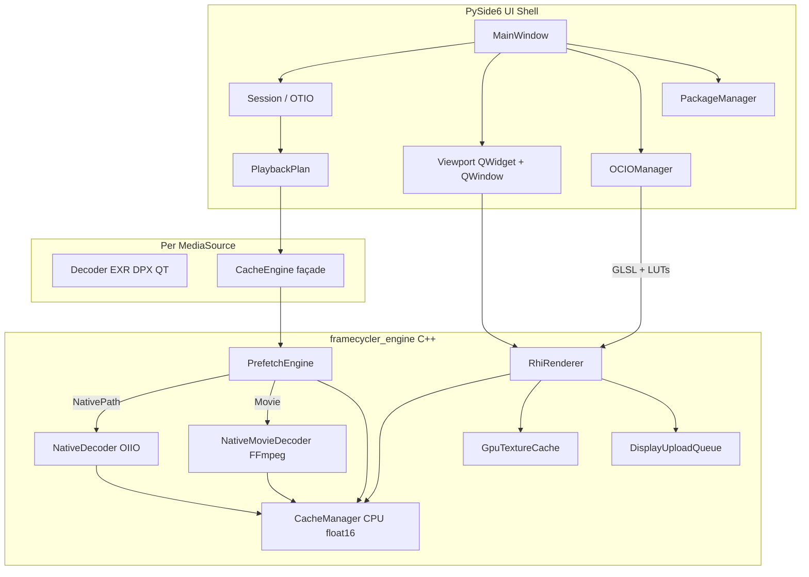
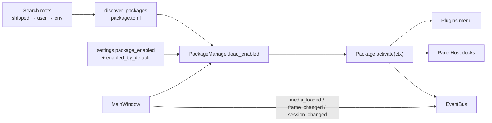

# Framecycler Reboot // VFX Review Application Technical Manual

Framecycler Reboot is a high-performance, lightweight Visual Effects Review application for Windows, macOS, and Linux. It uses a **hybrid architecture**: a compiled C++20 engine (`framecycler_engine`) for decode-RAM caching, native movie decode, and Qt RHI GPU presentation, plus a Python 3.12+ / PySide6 (Qt 6.10+) UI shell for OTIO timeline coordination, transport, OCIO, and discoverable **packages** (plugins).

---

## 1. Architectural System Overview

Framecycler splits hot paths into C++ so decode and present can run without holding the Python GIL, while Python owns session/timeline logic and extensibility. Media is organized as an **OTIO timeline of shot stacks** (versions = clips). Each version that has on-disk media maps to a ref-counted `MediaSource` (decoder + `CacheEngine`) in a `MediaPool`.



### Key subsystem division

* **Python layer**: UI, transport timer, `Session` / OTIO timeline, `PlaybackPlan`, OCIO config and shader source generation, package discovery/loading, and thin decoder façades.
* **C++ core (`framecycler_engine`)**: `PrefetchEngine` (budget-aware decode fill), `CacheManager` (CPU float16 RAM), `NativeMovieDecoder` (FFmpeg), OIIO stills decode, `RhiRenderer` (dedicated render thread), `GpuTextureCache`, and `DisplayUploadQueue`.

Present is **authoritative**: if the CPU cache already has a frame on a GPU miss, the renderer uploads it in the current batch and draws immediately (no black first pass). Async GPU upload covers decode-behind cases.

---

## 2. Core Engine Subsystems

### A. Session, OTIO timeline, and media pool

| Piece | Path | Role |
| :--- | :--- | :--- |
| `Session` | [`src/framecycler/core/session.py`](src/framecycler/core/session.py) | Owns the OTIO timeline, media pool, and playback plan; add/replace/stack media |
| `otio_model` | [`src/framecycler/core/otio_model.py`](src/framecycler/core/otio_model.py) | Timeline = track of shot **Stacks**; versions = **Clips**; Framecycler metadata under `metadata["framecycler"]` |
| `PlaybackPlan` | [`src/framecycler/core/playback_plan.py`](src/framecycler/core/playback_plan.py) | Flattened global segments, active/compare versions, decoder-frame mapping |
| `MediaPool` | [`src/framecycler/core/media_pool.py`](src/framecycler/core/media_pool.py) | Ref-counted path → `MediaSource` (decoder + `CacheEngine`) |
| `MediaSource` | [`src/framecycler/core/media_source.py`](src/framecycler/core/media_source.py) | Runtime decode/cache resource (not timeline ownership) |

* **Shots / versions**: The **Shots** panel (`source_list_panel.py`) lists OTIO stacks with nested version clips. Toggle via **View → Shots** (hidden by default).
* **Global timeline**: Segments concatenate into one playback range. Transport, looping, and in/out operate in that space. `Ctrl + Left/Right` jumps clip boundaries.
* **Compare sync**: Wipe / Difference / Tile sample active (and compare) versions at the same global playhead; out-of-range frames clamp to clip ends.
* **OTIO metadata**: Per-clip input color space; ASC CDL on Clip > Stack > Timeline (see OCIO section).

### B. Prefetch engine (`PrefetchEngine`)

Located in [`src/cpp/engine/prefetch_engine.{h,cpp}`](src/cpp/engine/prefetch_engine.h). Python [`CacheEngine`](src/framecycler/core/cache.py) is a thin façade: it configures the engine and does **not** run a Python thread pool for decode.

**Decode modes**

| Mode | When | Path |
| :--- | :--- | :--- |
| `NativePath` | EXR/DPX sequences (`uses_native_path_decode()`) | OIIO `decode_and_cache_frame` → `CacheManager` |
| `Movie` | QuickTime/MP4 (`uses_native_movie_decode()`) | Shared `NativeMovieDecoder` → `write_frame` (no GIL on hot path); serial concurrency 1 |
| `PythonFallback` | Test stubs / non-file containers | GIL callback → `read_frame` → `write_frame` |

**Fill policy**: Default is **budget-aware** (fill until decode RAM budget is near full). Explicit `set_lookahead(n)` is a test override. Planner + worker threads wake on playhead/range/options; prefetch stays disabled until `CacheEngine.start()` so frame-ready callbacks can be registered first.

**Shutdown**: Workers join first; Python callbacks and the movie decoder are cleared under the GIL afterward so `py::object` teardown is safe.

### C. CPU frame cache (`CacheManager`)

Located in [`src/cpp/engine/cache_manager.{h,cpp}`](src/cpp/engine/cache_manager.h).

* Contiguous **float16** slots up to **Settings → Decode Cache** (`decode_cache_limit_gb`).
* Playhead-distance eviction within the in/out loop range.
* Decode claims (`try_claim_decode`) prevent duplicate work across workers.
* Slots live in a `deque` so growth does not relocate existing frames; Python `get_frame_data` returns a **copied** array under lock (safe while prefetch writes).

### D. GPU display cache and upload queue

| Piece | Path | Role |
| :--- | :--- | :--- |
| `GpuTextureCache` | [`gpu_texture_cache.{h,cpp}`](src/cpp/engine/gpu_texture_cache.h) | QRhi textures keyed by `(source_index, decoder_frame)`; separate GB limit |
| `DisplayUploadQueue` | [`display_upload_queue.{h,cpp}`](src/cpp/engine/display_upload_queue.h) | CPU-side upload job bookkeeping |

* **Present-authoritative**: On display miss + CPU hit, upload into the current RHI batch and bind immediately.
* **Upload policy** follows playback timing: Every Frame enqueues distinctly; Realtime coalesces per source.
* Timeline overlay can show both RAM and GPU residency.

### E. Qt RHI viewport renderer (`RhiRenderer`)

Located in [`src/cpp/engine/rhi_renderer.cpp`](src/cpp/engine/rhi_renderer.cpp). The viewport hosts a native `QWindow` bound to `RhiRenderer` on a dedicated render thread.

* **Backends**: Metal (macOS), D3D11 (Windows), Vulkan (Linux); Null when `QT_QPA_PLATFORM=offscreen`.
* **Shaders**: GLSL from Python/OCIO compiled via `QShaderBaker` to platform binaries.
* **Compare modes**: Sequence (playhead source), Wipe / Difference (slots 0 vs 1), Tile (aspect-preserving grid).
* **Resize**: Viewport always refreshes `RenderParams` (fit/tile scales) on size changes so the image does not stretch until the next seek/play.

### F. Playback timing

Located in [`src/framecycler/core/playback_timing.py`](src/framecycler/core/playback_timing.py). Menu: **Playback → Play Every Frame** / **Play Realtime**.

| Mode | Behavior |
| :--- | :--- |
| **Play Every Frame** | Advance one frame only when the next target is decode-ready; may stall for quality |
| **Play Realtime** | Wall-clock catch-up from a playback anchor; may skip frames |

Upload-queue policy mirrors the selected timing mode.

---

## 3. PyBind11 Bindings Layer

Defined in [`src/cpp/bindings/python_bindings.cpp`](src/cpp/bindings/python_bindings.cpp). The module exposes `CacheManager`, `PrefetchEngine`, `PrefetchDecodeMode`, `NativeMovieDecoder`, `RhiRenderer`, `DisplayUploadQueue`, and shared structs (`RenderParams`, `FrameSlotSpec`, `TileSpec`).

Python `get_frame_data` copies pixels under `CacheManager` locks into an owned NumPy buffer so concurrent prefetch cannot dangle views into relocating storage.

---

## 4. Media Decoding & Sequence Resolving

Located in [`src/framecycler/decoders/`](src/framecycler/decoders/).

| Format | Python | Native path |
| :--- | :--- | :--- |
| EXR | `exr_decoder.py` | OIIO (`NativeDecoder`) |
| DPX | `dpx_decoder.py` | OIIO (`NativeDecoder`) |
| QuickTime / MPEG-4 | `qt_decoder.py` (thin shell) | FFmpeg (`NativeMovieDecoder`) |

**Movies (`NativeMovieDecoder`):** Builds a packet/keyframe index for frame-accurate scrub; converts via high-bit `RGBA64` (or `RGBAF32`) into float16 for the RAM cache (no forced 8-bit). Hardware decode is tried automatically — VideoToolbox (macOS), D3D11VA (Windows), VAAPI (Linux) — with silent software fallback if HW init/decode fails. ProRes/DNx/HW support depends on the linked FFmpeg build and OS drivers. Movie prefetch remains serial (one shared decoder).

### Sequence detection

Opening or dropping a single file runs `_find_sequence_from_single_file` in `base.py`: it parses the index pattern (e.g. `MOC_CAS_0010.0993.exr` → `MOC_CAS_0010.####.exr`), gathers matching files, and builds a timeline on absolute frame indices. Missing frames can fall back to the nearest available index (or a Flat Gray / Red X placeholder depending on settings).

### Timecode → absolute frames

* **Image sequences**: Frame numbers come from filenames.
* **Movies**: Start timecode from stream/container metadata (default `01:00:00:00`) maps to absolute frames so sequences and clips share one global timeline (e.g. `08:00:00:00` → `691200` at 24 fps).

---

## 5. OCIO Color Pipeline

Located in [`src/framecycler/color/`](src/framecycler/color/) (`ocio_manager.py`) with the default studio config at [`src/framecycler/color/studio_config/config.ocio`](src/framecycler/color/studio_config/config.ocio).

### Configuration loading priority

| Priority | Source | Notes |
| :--- | :--- | :--- |
| **1** | `OCIO` environment variable | Must point to an existing `.ocio` file |
| **2** | Settings file path | **File → Settings… → Custom OCIO Configuration File** |
| **3** | Bundled studio config | `color/studio_config/config.ocio` |

```bash
# macOS / Linux
export OCIO=/show/configs/project.ocio
python -m src.framecycler
```

```powershell
# Windows PowerShell
$env:OCIO = "D:\show\configs\project.ocio"
python -m src.framecycler
```

Persisted settings live in `~/.framecycler/settings.json` (`ocio_config_path`).

### Bundled studio configuration

OCIO profile **2.2**; reference/working space **ACEScg**. Display views include `sRGB View`, `Rec.709 View`, `ACEScg Linear`, and `Raw`. Looks include ARRI LogC3/LogC4 → Rec709 examples. LUT search path is `luts/` relative to the config.

Supported camera logs mapped into the linear reference include ARRI LogC3/LogC4, Cineon (ADX10), Sony S-Log3, Panasonic V-Log, and RED Log3G10.

### Runtime controls

**OCIO** menu: Input Color Space, Look (**None (Bypass)**), Display Output, **Load Custom LUT…**. The viewport header shows pipeline state (e.g. `IN: ARRI Alexa LogC3 | OUT: sRGB (sRGB View)`).

### Input color space detection

On load, input space can be inferred from metadata, filename hints, or extension fallbacks, then validated against the active config. Per-clip overrides persist on the OTIO clip under `framecycler.input_colorspace`.

### GPU shaders and grading

Transforms compile to GLSL 450 in Python and bake through `QShaderBaker` in C++. Interactive exposure/gamma/offset update a uniform buffer without rebuilding the pipeline. ASC CDL (`OCIO.CDLTransform`) rebuilds when values change.

**Per-level OTIO CDL**: Stored under `metadata["framecycler"]["cdl"]` on Clip (version), Stack (shot), or Timeline. Resolution is **Clip > Stack > Timeline > identity**. The viewer applies the resolved CDL for the playhead shot’s active version. Export/import round-trips these keys. `PackageContext.apply_cdl` is viewer-only; use `set_cdl_on_active_version` / `set_cdl_on_active_shot` / `set_cdl_on_timeline` to persist. **Reset Color Grade** clears the viewer grade/CDL but does not remove OTIO `cdl` keys.

Shader templates: [`src/framecycler/render/shaders/`](src/framecycler/render/shaders/); prep: [`shader_pipeline.py`](src/framecycler/render/shader_pipeline.py).

---

## 6. Packages (Plugins)

Packages are discoverable plugins: a directory with `package.toml` plus a Python entry module that subclasses `Package`. The host loads them into the **Plugins** menu. Core code lives under [`src/framecycler/packages/`](src/framecycler/packages/).



### Where packages are found

| Source | Path | Label |
| :--- | :--- | :--- |
| Shipped | Repo [`apps/`](apps/) (dev) or `{sys._MEIPASS}/apps` (frozen) | `shipped` |
| User | `~/.framecycler/packages/` | `user` |
| Extra | `FRAMECYCLER_APPS` environment variable (directory of package folders) | `env` |

Discovery order is **shipped → user → env**. The first package with a given `id` wins; later duplicates are skipped.

```bash
# Optional extra root (macOS / Linux)
export FRAMECYCLER_APPS=/show/framecycler/packages
```

```powershell
$env:FRAMECYCLER_APPS = "D:\show\framecycler\packages"
```

### Enabling packages

1. Place the package folder in a search root (or use a shipped example).
2. Open **File → Settings… → Packages**, check the package, and click **OK**.
3. **Restart** Framecycler (enable/disable is applied at startup via `PackageManager.load_enabled()`).

Overrides that differ from `enabled_by_default` are stored in `~/.framecycler/settings.json` under `package_enabled`.

### Manifest (`package.toml`)

| Field | Required | Default | Notes |
| :--- | :--- | :--- | :--- |
| `id` | yes | — | Unique id (e.g. `studio.my_tool`) |
| `name` | yes | — | Display name |
| `entry` | yes | — | `module:Class` (colon required); loads `{module}.py` in the package dir |
| `version` | no | `0.0.0` | |
| `description` | no | `""` | |
| `enabled_by_default` | no | `false` | Used when no settings override exists |

### How packages are imported

On menu setup, `MainWindow` constructs `PackageManager` and calls `load_enabled()`:

1. Discover manifests from search roots.
2. For each enabled id, load `{package_dir}/{entry_module}.py` with `importlib` (module name `framecycler_pkg_{id}`).
3. Instantiate the entry class (must subclass `Package`).
4. Call `activate(ctx)` with a `PackageContext`.
5. Collect `QAction`s into the **Plugins** menu and panel specs into **PanelHost** (View → Panels).

Entry modules must be a **top-level `.py` file** in the package directory (not a nested package path). Prefer the dual import used by shipped examples so the same code works from source and frozen builds:

```python
try:
    from src.framecycler.packages.api import Package, PackageContext
except ImportError:
    from framecycler.packages.api import Package, PackageContext
```

### Writing a custom package

**Layout**

```
~/.framecycler/packages/my_studio_tool/
  package.toml
  package.py
```

**`package.toml`**

```toml
id = "studio.my_tool"
name = "My Studio Tool"
version = "0.1.0"
description = "Does something useful."
entry = "package:MyToolPackage"
enabled_by_default = false
```

**`package.py`**

```python
from PySide6.QtGui import QAction

try:
    from src.framecycler.packages.api import Package, PackageContext
except ImportError:
    from framecycler.packages.api import Package, PackageContext


class MyToolPackage(Package):
    def activate(self, ctx: PackageContext) -> None:
        action = QAction("Do Thing", ctx.parent_widget())
        action.triggered.connect(lambda: self._run(ctx))
        ctx.add_menu_actions([action])
        ctx.subscribe("media_loaded", self._on_media)

        from PySide6.QtWidgets import QLabel

        ctx.register_panel(
            "status",
            title="My Tool",
            factory=lambda parent: QLabel("Hello from panel", parent),
            default_area="right",
            visible_by_default=False,
        )

    def _run(self, ctx: PackageContext) -> None:
        ctx.status("Hello from package")
        ctx.logger.info("ran")

    def _on_media(self, source_index, path, metadata) -> None:
        pass
```

Panels appear under **View → Panels**. They can dock to any edge or float (including onto another monitor). Layout is persisted via `main_window_state` / `main_window_geometry` in settings.

### `PackageContext` API (host services)

| API | Purpose |
| :--- | :--- |
| `package_id`, `package_dir`, `logger` | Identity / logging (`framecycler.package.{id}`) |
| `session` | OTIO session / timeline |
| `ocio` | OCIO manager |
| `settings` | App settings |
| `add_media(paths, mode="sequence"\|"stack")` | Load media onto the session |
| `add_menu_actions([...])` | Contribute to **Plugins** |
| `register_panel(panel_id, *, title, factory, default_area="right", visible_by_default=False)` | Dockable panel; id becomes `{package_id}.{panel_id}` |
| `register_keybind(id, *, sequence, callback, context="app")` | App shortcut (built-ins always win on conflict) |
| `register_hud_painter(id, *, paint, z=0)` | Paint-only HUD overlay when View → Toggle HUD is on |
| `define_settings_schema([...])` / `get_setting` / `set_setting` | Per-package settings (Settings → Packages) |
| `register_decoder(id, *, extensions, factory, priority=0)` | Still decoder for unique extensions (not movies) |
| `status(message)` | Status bar |
| `parent_widget()` | `MainWindow` as Qt parent |
| `update_ocio_pipeline()` | Refresh viewer OCIO |
| `apply_cdl(...)` | Viewer-only ASC CDL (not OTIO) |
| `apply_resolved_cdl()` | Re-apply Clip > Stack > Timeline CDL |
| `set_cdl_on_active_version` / `_shot` / `_timeline` | Persist CDL to OTIO |
| `clear_cdl_on_*` | Clear persisted CDL |
| `subscribe` / `unsubscribe` | Event bus |

**Events**: `media_loaded` `(source_index, path, metadata)`, `frame_changed` `(frame_index, timecode)`, `session_changed` (no payload). Constants: `PackageEvents` in [`api.py`](src/framecycler/packages/api.py).

During playback, `frame_changed` is **coalesced** (latest-wins per GUI event-loop turn) so packages cannot stall transport. Scrubbing / paused seeks emit every frame immediately. Package enable/disable and settings apply on Settings OK without restart.

### Shipped example packages

All under [`apps/`](apps/):

| Directory | Id | Default | What it demonstrates |
| :--- | :--- | :--- | :--- |
| [`example_apply_cdl`](apps/example_apply_cdl/) | `framecycler.example_apply_cdl` | off | Plugins → “Apply Example CDL”: hardcoded viewer CDL via `ctx.apply_cdl` (stub for ShotGrid/ftrack fetch) |
| [`example_add_version`](apps/example_add_version/) | `framecycler.example_add_version` | off | Writes a grey EXR and `ctx.add_media(..., mode="stack")` onto the playhead shot |
| [`example_per_stack_cdl`](apps/example_per_stack_cdl/) | `framecycler.example_per_stack_cdl` | off | Alternating R/G/B slopes per shot stack via session stack CDL APIs |
| [`example_session_panel`](apps/example_session_panel/) | `framecycler.example_session_panel` | off | Full API demo: panel, coalesced `FRAME_CHANGED`, `Ctrl+Shift+S`, HUD badge, settings, `.fcpanel` decoder |
| [`ocio_api_loader`](apps/ocio_api_loader/) | `framecycler.ocio_api_loader` | **on** | Mock “Load OCIO from External API…” → `ctx.ocio.load_config(...)` |

Enable the examples under **Settings → Packages**, restart, then use **Plugins** / **View → Panels**.

Key implementation files: [`api.py`](src/framecycler/packages/api.py), [`manager.py`](src/framecycler/packages/manager.py), [`panel_host.py`](src/framecycler/ui/panel_host.py), [`manifest.py`](src/framecycler/packages/manifest.py), [`paths.py`](src/framecycler/packages/paths.py). Tests: [`tests/test_packages.py`](tests/test_packages.py), [`tests/test_panel_host.py`](tests/test_panel_host.py).

---

## 7. User Interface & Layout Structure

Located in [`src/framecycler/ui/`](src/framecycler/ui/).

* **Shots panel** (`source_list_panel.py`): OTIO shot stacks with nested versions (select, reorder, remove, set active version). Dockable via **View → Panels → Shots** (starts hidden; can float to another monitor).
* **Compare** (Tools → Compare): Sequence, Wipe, Difference, Tile.
* **File → Add Media** / drag-and-drop **Replace** (left) vs **Add** (right).
* **Image menu**: Resolution scale and pixel aspect for the active selection; Sequence readout follows the playhead clip.
* **Playback timing**: Play Every Frame vs Play Realtime.
* **HUD**: Wipe divider overlay when Wipe is active.
* **Timeline**: Position row (`FR` / `FPS` / `TC`), cache indicators for decode RAM and display GPU where applicable.
* **Grading**: Exposure / gamma / offset drag modes; **Reset Color Grade** / `Home` clears viewer grade (OTIO CDL keys remain).
* **Plugins**: Actions from enabled packages; empty state when none are enabled.
* **Channel buttons**: `RGB`, `R`, `G`, `B`, `A`, `LUM` (checkable highlight).

---

## 8. Development & Compilation Instructions

### Automated script launches

* **Windows**: [run.bat](run.bat) — venv, deps, build if needed, launch.
* **macOS / Linux**: [run.sh](run.sh) — same flow on POSIX.

### Manual virtual environment setup

```powershell
# Windows
python -m venv .venv
.\.venv\Scripts\Activate.ps1
pip install -r requirements.txt
```

```bash
# macOS / Linux
python3 -m venv .venv
source .venv/bin/activate
pip install -r requirements.txt
```

### Compiling the C++ engine

Requires **CMake**, and on Windows **Visual Studio 2022 Build Tools (MSVC)**. System libraries: **OpenImageIO** and **FFmpeg** (`libavformat`, `libavcodec`, `libavutil`, `libswscale`) — e.g. `brew install openimageio ffmpeg` on macOS, matching `-dev` packages on Linux, or `vcpkg install openimageio ffmpeg` on Windows.

```bash
python build.py
```

* Fetches/resolves the Qt SDK via `aqtinstall` when needed, links Gui / Widgets / ShaderTools (including private modules for RHI), and installs the extension next to the Python package.
* On macOS the `.so` is ad-hoc signed for Gatekeeper after copy.
* Pinned UI dependency: `PySide6==6.10.3`.

### Running the app and tests

```bash
python -m src.framecycler
python -m unittest discover -s tests
```

### Application packaging & in-app updates (Velopack)

This is the **shipped installer** path (separate from Python packages/plugins above).

* **Release builds**: [`.github/workflows/package.yml`](.github/workflows/package.yml) on tags like `v0.3.3`. Each platform builds with PyInstaller, packages with [Velopack](https://velopack.io), and publishes to GitHub Releases.
* **First install**: Download the Velopack installer/portable bundle for your OS from the Release page.
* **Updates**: In a packaged build, **Help → Check for Updates…**. Not available when running from source.
* **Unsigned builds (current)**: Gatekeeper / SmartScreen may warn; use the usual Open workaround.
* **Retrying a failed release**: Delete the GitHub Release for that tag before a full re-run if assets were partially uploaded; Velopack `--merge` cannot replace existing assets such as `releases.win.json`.

---

## 9. Keyboard Hotkeys Reference

On macOS, shortcuts written as **Ctrl** use the **Command (⌘)** key (Qt cross-platform convention).

### Playback & timeline

| Key | Action |
| :--- | :--- |
| `Space` | Play / pause |
| `Left` / `Right` | Step backward / forward by 1 frame |
| `Shift + Left` / `Shift + Right` | Step backward / forward by 10 frames |
| `Ctrl + Left` / `Ctrl + Right` | Jump to previous / next clip; sets in/out to that clip and seeks to its first frame |
| `[` | Set playback range **in** point |
| `]` | Set playback range **out** point |
| `T` | Toggle frame number / timecode readout |

### File

| Key | Action |
| :--- | :--- |
| `Shift + X` | Clear all loaded media |

### View

| Key | Action |
| :--- | :--- |
| `Ctrl + H` | Toggle HUD overlay |
| `F` | Fit viewport to screen |
| `1` | Zoom to actual size (100%) |
| `2` | Zoom to 200% |
| `3` | Zoom to 300% |
| `4` | Zoom to 400% |

### Grading (Tools menu)

| Key | Action |
| :--- | :--- |
| `E` | Interactive **exposure** (drag horizontally in viewport) |
| `Y` | Interactive **gamma** |
| `O` | Interactive **offset** |
| `Home` | Reset color grading to defaults |

### Channel isolation

| Key | Action |
| :--- | :--- |
| `R` | Toggle **red** channel isolation (again for RGB) |
| `G` | Toggle **green** |
| `B` | Toggle **blue** |
| `A` | Toggle **alpha** |

### Viewport mouse

| Action | Behavior |
| :--- | :--- |
| Click | Toggle play / pause |
| Horizontal drag | Scrub frames (stops playback; playhead stays on release frame) |

Compare modes, playback timing, and **View → Shots** are menu-driven. Pixel aspect and resolution scale are adjusted from the **Image** menu.
